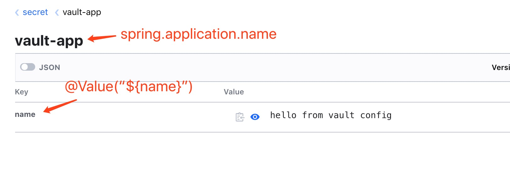

Spring Vault Demo
=========================

This project used to demostrate the spring cloud with Hashicorp Vault as the securet configuraiton.

### Environments
All the infrastruction environments are built with docker compose, the vault service and the mysql instance which used as the vault backend storage.

**Startup**
```
docker-compose up -d
```

### Generate static token

Here is the command used to generate the access token which will used in the spring application to access the vault servcie.

```
docker exec -it CONTAINER_ID /bin/sh

export VAULT_ADDR="http://127.0.0.1:8200"
export VAULT_TOKEN="s.wwO0zFPZuNhUl2nbQ1ULR43T"  # root token here
vault token create -policy=default
```

This will geneate the token with the default policy, the output as below:

```
Key                  Value
---                  -----
token                s.KaZhdSvMa12JKoxzqM1BTRQU
token_accessor       KhzX7QA1iGgnXpc9jFyZ5sEX
token_duration       768h
token_renewable      true
token_policies       ["default"]
identity_policies    []
policies             ["default"]
```

### Vault config the property

All the spring cloud config shoule locate in the **secure** parent path, and the vault configuration supports the slash-separated paths, just like the zookeeper.



- Where the parent path under "secret" folder is the spring aplication name which should be equals to `spring.application.name`. 
- Whete the secondary path sould be the **profile** path, it should equals to the `spring.profiles.action` value.
- Then the Key/Value pair, the which will be used as the configuration in the spring annotation like `@Value`

#### Command to config the property in vault

THe following command can be used to config the configuration in vault

```
vault kv put secret/vault-app/dev name="Hello from vault for dev environment"
```

And the vault also supports the `@ConfigurationProperties("example")` just like the normal propeties.